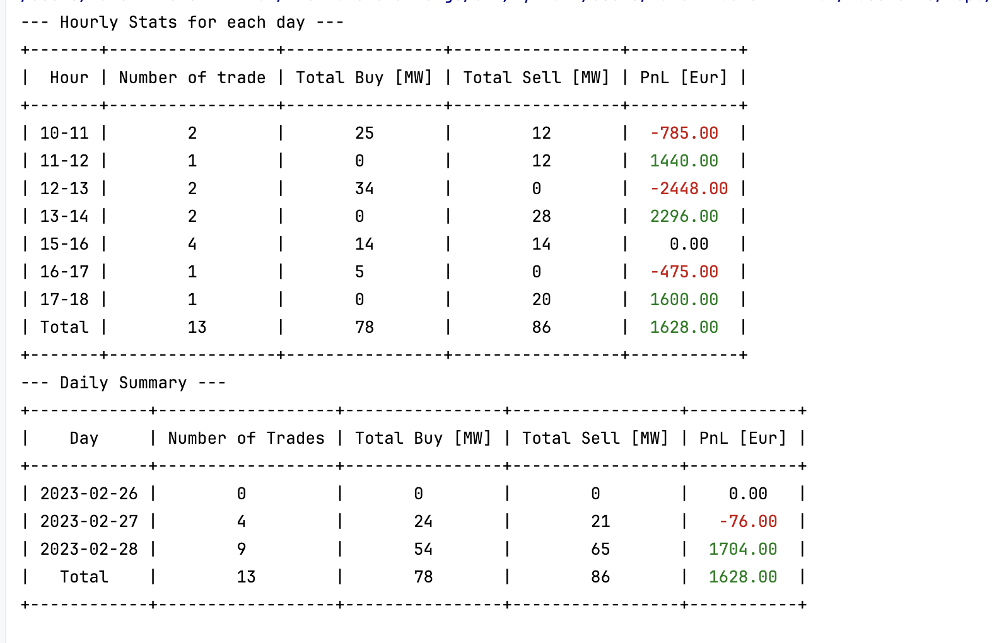
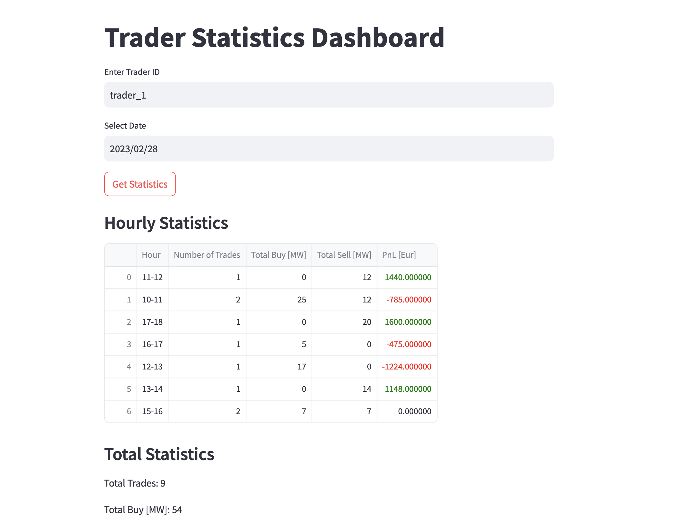

# Solution to FlexPower Challenge
---

This repository contains my solution for the engineering challenge at Flex Power. This README outlines the thought process behind the implementation and provides instructions on how to run the code.

# General 
I organized the files related to the task into separate modules. However, I avoided creating additional nested modules since most of them only contain a single file.


## Task 1
I used `Flask`, one of the most convenient frameworks in Python, along with `Flask-SQLAlchemy` and `SQLite` for database integration. `SQLite` was chosen because it’s file-based and easy to implement.

To ensure safety, I added a mechanism that prevents adding the same trade (based on its ID). I also implemented basic authorization, storing login and password in a simple dictionary for the sake of simplicity. The API is covered by `unit tests` for the following cases: authorized/unauthorized `GET` and `POST` methods.

# Task 2
For automation, I decided to use `cron` to schedule my script. I implemented it in a next way: around midnight, cron triggers my script, which checks for a specific file in a specified directory 
(based on the previous day). If the file is missing (for example, due to a delay from the exchange), the script checks every *30 minutes* until *8:00 AM* the next day. 
If the file is still not found, the `notify_user` function is called (tried to simulate real-world example). I also wrote a bash script, to easily run the script.

# Task 3
I really enjoyed this task! I added an extra tool that allows traders to check trades for both a specific date or a date range. 
The command-line arguments are: `trader_id --start_day=[start_day] --end_day=[end_day]`. The start and end dates are optional, and by default, the previous day's trades are retrieved. 
The results are fetched from the database and displayed in a formatted table using `PrettyTable`.


# Task 4
For this task, I reused most of the functions from Task 3. I chose `Streamlit` for the web interface, as it provides more flexibility compared to `Gradio`. 


# How to run

## Dockerized
1) `git clone git@github.com:Valerii3/FlexPowerChallenge.git`
2) `cd FlexPowerChallenge/`
3) `docker-compose up --build -d`
4) Now the service is already running and available in your browser. 

   You can check by using: `docker-compose logs flask_app` and click on the links. 
   To test first task, I already filled database with some synthetic data, you can go to `PostMan` and play with get and post methods. 
   Use following credentials for login and password: **Admin** **Password** 
5) `docker-compose run test_service` will run all the tests within the `test` directory.
6) `docker-compose up listener` will execute the scipt which triggers cron.
7) `docker-compose run cli_app [trader_id] --start_day=[optional] --end_day=[optional]` will run the third task.
8)  `docker-compose run streamlit_app` is already running as well. 
    You can check by using: `docker-compose logs flask_app` and click on the links. 

## Manually
1) `git clone git@github.com:Valerii3/FlexPowerChallenge.git`
2) `cd FlexPowerChallenge/`
3) Now we need to set up  thevirtual environment and install the dependencies:
   ```
   python3 -m venv venv
   source venv/bin/activate  # On macOS/Linux
   venv\Scripts\activate  # On Windows
   pip install -r requirements.txt
4) Now if you are using `PyCharm`, you can use the UI to run the files. For `cli_app` don't forget to pass the parameters into the the configuration file.
5) If you use terminal, python sometimes cant find the necessary `src` packages.
   To fix it, paste it into the terminal: `export PYTHONPATH="/path/to/repo/FlexPowerChallenge:$PYTHONPATH"
6) `python3 src/task1/app.py` will run the server
7) `python3` src/task2/listener.py` will run the script. You can uncomment line and fill the database with some data.
8)  `./src/task2/setup_cron.sh ` will run the second task. If its already running, the correspoding message will be displayed.
9) `python3 src/task3/cli_app.py [trader_id] --start_day=[YYYY-MM-DD] --start_day=[YYYY-MM-DD]` will run the third task. 
10) `streamlit run src/task4/web_app.py` will run the browser app with nice UI :)

## DATA
I filled `trade.db` with some sample data. The available dates are `2023-02-27` and `2023-02-28`, and there are only three unique trader IDs: `trader_1`, `trader_2`, and `trader_3`.
If you drop the database, you can repopulate it using the listener.py script. However, it won't add new records at the moment, because it would create duplicates.


`
   


